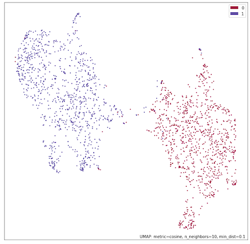

# imgbeddings

A Python package to generate embedding vectors from images, using [OpenAI](https://openai.com)'s robust [CLIP model](https://github.com/openai/CLIP) via [Hugging Face](https://huggingface.co) [transformers](https://huggingface.co/docs/transformers/index). These image embeddings, derived from an image model that has seen the entire internet up to mid-2020, can be used for many things: unsupervised clustering (e.g. via [umap](https://umap-learn.readthedocs.io/en/latest/)), embeddings search (e.g. via [faiss](https://github.com/facebookresearch/faiss)), and using downstream for other framework-agnostic ML/AI tasks such as building a classifier or calculating image similarity.

- The [embeddings generation models](https://huggingface.co/minimaxir/imgbeddings) are ONNX INT8-quantized, meaning they're 20-30% faster on the CPU, much smaller on disk, and doesn't require PyTorch or TensorFlow as a dependency!
- Works for many different image domains thanks to CLIP's zero-shot performance.
- Includes utilities for using [principal component analysis (PCA)](https://en.wikipedia.org/wiki/Principal_component_analysis) to reduces the dimensionality of generated embeddings without losing much info.

## Real-World Demo Notebooks



You can read how to use imgbeddings for real-world use cases in these Jupyter Notebooks:

- [Cats vs. Dogs](examples/cats_dogs.ipynb): image clustering and building a cat/dog classifier
- [Pokémon](examples/pokemon.ipynb): most-similar image search
- [Image Augmentation](examples/augmentation.ipynb): generated embedding resilience to altered inputs

## Installation

aitextgen can be installed from PyPI:

```sh
pip3 install imgbeddings
```

## Quick Example

Let's say you want to generate an image embedding for a [cute cat photo](http://images.cocodataset.org/val2017/000000039769.jpg). First you can download the photo:

```py3
import requests
from PIL import Image
url = "http://images.cocodataset.org/val2017/000000039769.jpg"
image = Image.open(requests.get(url, stream=True).raw)
```

Then, you can load imgbeddings. By default, imgbeddings will load a 88MB model based on the patch32 variant of CLIP, which separates each image into 49 32x32 patches.

```py3
from imgbeddings import imgbeddings
ibed = imgbeddings()
```

You can also load the patch16 model by passing `patch_size = 16` to `imgbeddings()` (more granular embeddings but takes about 3x longer to run), or the "large" patch14 model with `patch_size = 14` (3.5x model size, 3x longer than patch16).

Then to generate embeddings, all you have to is pass the image to `to_embeddings()`!

```py3
embedding = ibed.to_embeddings(image)
embedding[0][0:5] # array([ 0.914541, 0.45988417, 0.0350069 , -0.9054574 , 0.08941309], dtype=float32)
```

This returns a 768D [numpy](https://numpy.org) vector for each input, which can be used for pretty much anything in the ML/AI world. You can also pass a list of filename and/or [PIL](https://pillow.readthedocs.io/en/stable/index.html) Images for batch embeddings generation.

See the Demo Notebooks above for more advanced parameters and real-world use cases. More formal documentation will be added soon.

## Ethics

The [official paper for CLIP](https://openai.com/blog/clip/) explicitly notes that there are inherent biases in the finished model, and that CLIP shouldn't be used in production applications as a result. My perspective is that having better tools free-and-open-source to _detect_ such issues and make it more transparent is an overall good for the future of AI, especially since there are less-public ways to create image embeddings that aren't as accessible. At the least, this package doesn't do anything that wasn't already available when CLIP was open-sourced in January 2021.

If you do use imgbeddings for your own project, I recommend doing a strong QA pass along a diverse set of inputs for your application, which is something you should always be doing whenever you work with machine learning, biased models or not.

imgbeddings is not responsible for malicious misuse of image embeddings.

## Design Notes

- Note that CLIP was trained on square images only, and imgbeddings will pad and resize rectangular images into a square (imgbeddings deliberately does not center crop). As a result, images too wide/tall (e.g. more than a 3:1 ratio of largest dimension to smallest) will not generate robust embeddings.
- This package only works with image data intentionally as opposed to leveraging CLIP's ability to link image and text. For downstream tasks, using your own text in conjunction with an image will likely give better results. (e.g. if training a model on an image embeddings + text embeddings, feed both and let the model determine the relative importance of each for your use case)

For more miscellaneous design notes, see [DESIGN.md](DESIGN.md).

## Maintainer/Creator

Max Woolf ([@minimaxir](https://minimaxir.com))

_Max's open-source projects are supported by his [Patreon](https://www.patreon.com/minimaxir) and [GitHub Sponsors](https://github.com/sponsors/minimaxir). If you found this project helpful, any monetary contributions to the Patreon are appreciated and will be put to good creative use._

## See Also

- [Sentence Transformers](https://sbert.net/index.html), which has a [wrapper around CLIP](https://sbert.net/examples/applications/image-search/README.html) that supports Image-to-Image search.

## License

MIT
